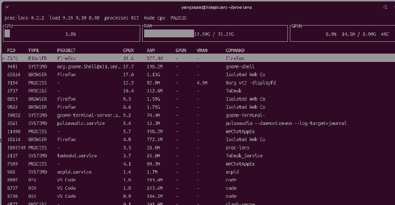

# proc-lens

[English](#english) · [中文](#中文)

`proc-lens` is a lightweight Linux process inspector for understanding **what a process is, who launched it, which application/project it belongs to, and what resources it is consuming**.

`proc-lens` 是一个轻量级 Linux 进程检查工具，重点回答：**这个进程是什么、由谁启动、属于哪个应用/项目，以及正在消耗多少资源**。

<p align="center">
  
</p>

> Screenshot captured from a real Ubuntu workstation. Values are machine/runtime dependent.  
> 截图来自真实 Ubuntu 工作站；资源数值会随机器和运行状态变化。

---

# English

## Why proc-lens?

Tools such as `top`, `htop`, and `btop` are excellent at showing resource usage, but on a robotics/development workstation the harder question is often **provenance**:

- Is this PID a ROS 2 node, a browser child, a systemd service, or a development tool?
- Which ROS 2 workspace or Git project does it belong to?
- Which parent application owns a generic child process?
- How much CPU, RAM, GPU, and VRAM is it consuming?

proc-lens combines `/proc`-native collection with deterministic direct classification and conservative display provenance.

## Ubuntu package installation

Starting with v0.2.3, Ubuntu x86_64 users can install proc-lens from the `.deb` attached to the matching GitHub Release. Rust and Cargo are **not** required at runtime.

```bash
sudo apt install ./proc-lens_0.2.3-1_amd64.deb
```

After installation you can either run:

```bash
proc-lens
```

or open the Ubuntu application menu, search for **proc-lens**, and click the icon. The desktop entry uses `Terminal=true`, so Ubuntu opens a terminal directly into the existing TUI instead of wrapping proc-lens in a separate GUI.

To uninstall:

```bash
sudo apt remove proc-lens
```

Developers can build the package locally with:

```bash
cargo install cargo-deb --locked
./scripts/build-deb.sh
```

The generated package is validated before the script prints its path.

## Stable live view

- system/process data sampled every **1 second**
- TUI process CPU smoothed with EMA `alpha = 0.35`
- automatic reorder at most every **2 seconds**
- selection anchored to PID instead of row number
- search/filter changes preserve visual position
- `Space` freezes the view; `r` performs one refresh while paused

## Direct classification and display provenance

Direct classification answers what a PID itself proves from executable, command line, environment, and cgroup evidence. Display provenance answers which meaningful Browser/DEV ancestor owns a generic child. Inherited ownership never replaces the current PID's direct evidence.

Example:

```text
firefox (BROWSER)
└── Isolated Web Co (direct PROCESS) -> display BROWSER / Firefox
```

## DEV project fallback

Development PROJECT labels use this conservative order:

```text
verified Git workspace
    ↓ unavailable
known development application family
    ↓ unavailable
-
```

Initial family labels include `VS Code`, `Rust`, `Clang`, and `Python`. A family label is not a guessed repository; a verified Git root always wins.

## Build from source

Requirements: Linux, Rust 1.88+, optional NVIDIA/NVML for GPU metrics.

```bash
cargo build --release
```

CPU-only build:

```bash
cargo build --release --no-default-features
```

## Usage

```bash
proc-lens
proc-lens snapshot
proc-lens inspect 18452
proc-lens --type ros2
proc-lens --type dev snapshot
proc-lens --type browser snapshot
```

## Keyboard controls

| Key | Action |
| --- | --- |
| `j` / `↓` | Select next process |
| `k` / `↑` | Select previous process |
| `PageDown` / `PageUp` | Move one visible page |
| `Home` / `End` | Select first / last visible process |
| `Enter` | Inspect selected PID |
| `/` | Search command/type/project |
| `Space` | Pause / resume |
| `r` | Refresh once while paused |
| `t` | Toggle process-tree order |
| `c` / `m` / `g` / `p` | Sort by CPU / RAM / GPU / PID |
| `?` | Toggle help |
| `q` / `Esc` | Back / close / quit |

## CPU and GPU semantics

The top CPU gauge is **whole-system utilization**. Per-process CPU is a process-level metric and is not expected to sum directly to the top gauge on a multi-core machine.

Global GPU utilization, memory, temperature, and power are read through NVML when available. Per-process VRAM is derived from active graphics/compute contexts. Per-process GPU utilization is optional; missing values remain `-`.

## Verification

```bash
./scripts/verify.sh
```

It checks formatting, Clippy, all-feature tests, CPU-only tests, and a release build. GitHub Actions also checks Rust 1.88 and builds/validates the Ubuntu `.deb`.

## Scope of v0.2.3

v0.2.3 is packaging-only: Debian package metadata, Ubuntu desktop launcher/icon, package validation, and GitHub Release artifact publishing. It does not add kill/renice, grouped family views, historical graphs, GUI wrappers, AppImage/Snap/Flatpak, ARM64 artifacts, or new runtime classification behavior.

---

# 中文

## 为什么做 proc-lens？

`top`、`htop`、`btop` 很擅长显示资源占用，但在机器人/开发工作站上，更困难的问题往往是**进程来源和归属**：

- 这个 PID 是 ROS 2 节点、浏览器子进程、systemd 服务，还是开发工具？
- 它属于哪个 ROS 2 workspace 或 Git 项目？
- 一个名字很泛化的子进程究竟属于 Firefox、VS Code 还是别的应用？
- 它消耗了多少 CPU、RAM、GPU 和 VRAM？

proc-lens 直接读取 `/proc`，使用可解释的直接分类规则，再通过父进程链补充保守的显示归属。

## Ubuntu 软件包安装

从 v0.2.3 开始，Ubuntu x86_64 用户可以直接下载对应 GitHub Release 中附带的 `.deb`，安装后**不需要 Rust 或 Cargo**。

```bash
sudo apt install ./proc-lens_0.2.3-1_amd64.deb
```

安装完成后可以直接执行：

```bash
proc-lens
```

也可以打开 Ubuntu 应用菜单，搜索 **proc-lens** 并点击图标。桌面启动器使用 `Terminal=true`，因此会自动打开终端并进入现有 TUI，而不是另外套一层 GUI。

卸载：

```bash
sudo apt remove proc-lens
```

开发者本地构建 `.deb`：

```bash
cargo install cargo-deb --locked
./scripts/build-deb.sh
```

脚本会先完成项目验证，再构建 `.deb`，校验包内路径/版本/架构，最后打印软件包路径。

## 稳定实时视图

- 系统/进程数据每 **1 秒**采样一次
- TUI 进程 CPU 使用 `alpha = 0.35` 的 EMA 平滑
- 自动重排最多每 **2 秒**一次
- 选中状态锚定 PID，而不是表格行号
- 搜索/过滤后尽量保留原来的视觉位置
- `Space` 冻结整个视图；暂停时 `r` 只刷新一次

## 直接分类与显示归属

直接分类只回答“这个 PID 自己有哪些证据”；显示归属回答“Generic 子进程属于哪个有意义的 Browser/DEV 祖先进程”。继承得到的归属不会覆盖当前 PID 的直接分类证据。

例如：

```text
firefox (BROWSER)
└── Isolated Web Co (直接 PROCESS) -> 显示 BROWSER / Firefox
```

## DEV 项目标记回退

开发进程的 PROJECT 按以下顺序解析：

```text
已验证 Git workspace
    ↓ 没有
已知开发应用族
    ↓ 没有
-
```

当前保守应用族包括 `VS Code`、`Rust`、`Clang`、`Python`。应用族不是猜测仓库；只要能验证 Git 根目录，就始终优先显示真实项目名。

## 源码构建

要求：Linux、Rust 1.88+；GPU 信息可选 NVIDIA/NVML。

```bash
cargo build --release
```

CPU-only：

```bash
cargo build --release --no-default-features
```

## 使用

```bash
proc-lens
proc-lens snapshot
proc-lens inspect 18452
proc-lens --type ros2
proc-lens --type dev snapshot
proc-lens --type browser snapshot
```

## 快捷键

| 按键 | 功能 |
| --- | --- |
| `j` / `↓` | 下一个进程 |
| `k` / `↑` | 上一个进程 |
| `PageDown` / `PageUp` | 翻页 |
| `Home` / `End` | 首行 / 末行 |
| `Enter` | 查看当前 PID 详情 |
| `/` | 搜索 command/type/project |
| `Space` | 暂停 / 恢复 |
| `r` | 暂停时单次刷新 |
| `t` | 切换进程树排序 |
| `c` / `m` / `g` / `p` | CPU / RAM / GPU / PID 排序 |
| `?` | 帮助 |
| `q` / `Esc` | 返回 / 关闭 / 退出 |

## CPU / GPU 口径

顶部 CPU 是**整机总体利用率**；单进程 CPU 是进程级指标，在多核机器上不能简单和顶部数值相加比较。

全局 GPU 利用率、显存、温度和功耗在 NVML 可用时读取。单进程 VRAM 来自活跃 graphics/compute context；驱动没有提供新鲜单进程 GPU 利用率时继续显示 `-`，不会伪造 `0%`。

## 验证

```bash
./scripts/verify.sh
```

它会检查格式、Clippy、全特性测试、CPU-only 测试和 release build。GitHub Actions 还会检查 Rust 1.88，并构建/验证 Ubuntu `.deb`。

## v0.2.3 边界

v0.2.3 只负责包装发布：Debian metadata、Ubuntu 桌面启动器/图标、软件包验证、GitHub Release `.deb`。不在这一版加入 kill/renice、进程族聚合视图、历史曲线、GUI wrapper、AppImage/Snap/Flatpak、ARM64 产物或新的运行时分类规则。

## License / 许可证

MIT
